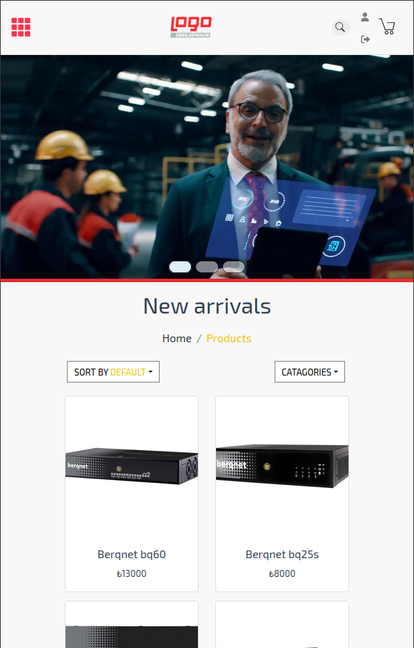
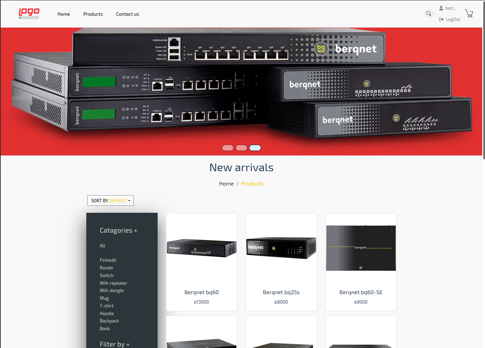

<div id="top"></div>

<!-- ABOUT THE PROJECT -->

<div align="center">
    <h1 id="about-the-project">About The Project</h1><br/><br/>
    &nbsp;&nbsp;&nbsp;
    
    <br/><br/><br/><br/>
    <h2>It is the front-end design of the application that I have prepared as a graduation project of the Bootcamp program.</h2>
    <br/>
</div>

<br/><br/>

<hr>
<h1 align="center"><a href="https://logo-ecommerce.herokuapp.com" target="_blank" rel="noopener noreferrer">--> Try This Application Live <--</a></h1>


<br/><br/>
<br/><br/>

<div align="center">
   <h1 id="built-with">Built With<h1>
   <table class="center" target="_blank" rel="noreferrer">
   <tr>
   <td><a href="https://vuejs.org/" target="_blank" rel="noreferrer">
   
   </a>
   <td><a href="https://developer.mozilla.org/en-US/docs/Web/JavaScript">
   
   </a> 
   <td><a href="https://nodejs.org/en/" target="_blank" rel="noreferrer">
   
   </a>
   <td><a href="https://axios-http.com/docs/intro" target="_blank" rel="noreferrer">
   
   </a> 
   <td><a href="https://getbootstrap.com/" target="_blank" rel="noreferrer">
   
   <td><a href="https://fortawesome.com/" target="_blank" rel="noreferrer">
   
   </a>
   </a>
   </tr>
   </table>
</div>

<h2 align="center">Components Hierarchy</h2><br><br>

```
.components

├─ ContactPage
|      └─ ContactForm.vue
├─ HomePage
|      └─ Carousel.vue
├─ InfoPage
|      ├─ InfoBox.vue
|      ├─ InfoBreadcrumb.vue
|      └─ InfoText.vue
├─ ModalComponents
|      ├─ Cart.vue
|      ├─ LoginModal.vue
|      ├─ ProductInfoModal.vue
|      └─ RegisterModal.vue
├─ ProductsPage
|      ├─ Breadc.vue
|      ├─ Card.vue
|      ├─ Grid.vue
|      └─ slider.vue
├─ Footer.vue
├─ Header.vue
└─ PageLoader.vue
```

<hr><br><br>

<!-- GETTING STARTED -->
## Getting Started

### Prerequisites

Check the node package manager, install it.
* npm
  ```sh
  npm install npm@latest -g
  ```

### Installation

1. Clone the repo
2. Go to the directory
3. Install NPM packages
   ```sh
   npm install
   ```
4. Change "API_URL" values on your case
   ```sh
   const API_URL = "http://localhost:5000";
   ```
5. Run
   ```sh
   npm run serve
   ```
6. You can execute all the build tasks available to your project.
   ```sh
   npm run build
   ```
7. That you also ensure your code has no structural problems by running the code through lint.
   ```sh
   npm run lint
   ```


<!-- CONTACT -->
## Contact

Ramazan Ustuntas - [![LinkedIn][linkedin-shield]][linkedin-url]


<p align="right">(<a href="#top">back to top</a>)</p>


[linkedin-shield]: https://img.shields.io/badge/-LinkedIn-black.svg?style=for-the-badge&logo=linkedin&colorB=555
[linkedin-url]: https://www.linkedin.com/in/ramazan-ustuntas/

